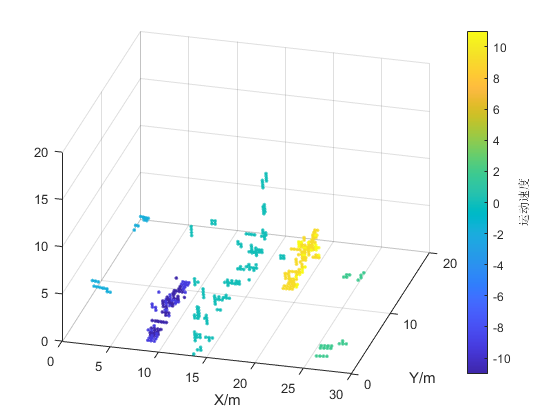

# Document Structure
* 2D_FFT+2D_MUSCI
  * ref_ofdm_imaging_2DFFT_2DMUSIC.m  (Main function)
  * qamxxx.m & demoduqamxxx.m  (Modulation and demodulation)
  * xxxx_CFAR.m  (CFAR Detection)
  * environment_SE.m  (Simplified version of scatterer simulation)
  * environment.m  (Scatterers simulation)
  * environment_disp.m  (Display the simulation of environment)
  * goldseq.m & m_generate.m  (Sequence generation)
  * rcoswindow.m  (OFDM windowing algorithm)
# Imaging Results Presentation

