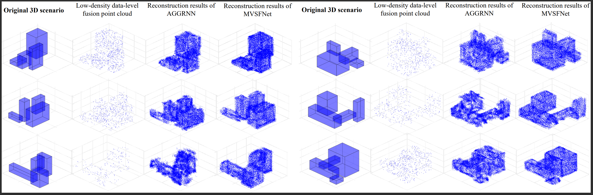

# ISAC_4D_IMaging
4D ISAC Imaging Simulation Based on Millimeter Wave OFDM Signals with MUSIC Algorithm Written in Matlab
Deep Learning Based Multi-Node ISAC 4D Environmental Reconstruction with Uplink- Downlink Cooperation
# Document Structure
* 2D_FFT+2D_MUSCI
  * ref_ofdm_imaging_2DFFT_2DMUSIC.m  (Main function)
  * qamxxx.m & demoduqamxxx.m  (Modulation and demodulation)
  * xxxx_CFAR.m  (CFAR Detection)
  * environment_SE.m  (Simplified version of scatterer simulation)
  * environment.m  (Scatterers simulation)
  * environment_disp.m  (Display the simulation of environment)
  * goldseq.m & m_generate.m  (Sequence generation)
  * rcoswindow.m  (OFDM windowing algorithm)
## Imaging Results Presentation

* 4D_FFT
  * ref_ofdm_imaging_4DFFT.m  (Main function)
  * qamxxx.m & demoduqamxxx.m  (Modulation and demodulation)
  * xxxx_CFAR.m  (CFAR Detection)
  * environment_SE.m  (Simplified version of scatterer simulation)
  * environment.m  (Scatterers simulation)
  * environment_disp.m  (Display the simulation of environment)
  * goldseq.m & m_generate.m  (Sequence generation)
  * rcoswindow.m  (OFDM windowing algorithm)
## Imaging Results Presentation

## Single Node Metric
* Metric.py

## Multi-Node UL-DL Cooperation 
The paper is being submitted and the code is being organized, so stay tuned!

## Publication of papers
* Single Node
https://ieeexplore.ieee.org/document/10465113
https://doi.org/10.48550/arXiv.2310.06401
* Multi Node
https://arxiv.org/abs/2404.14862
